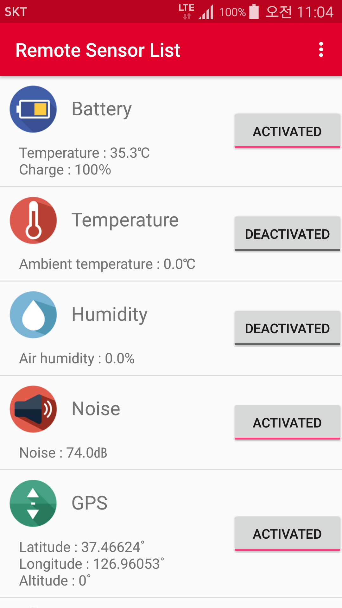
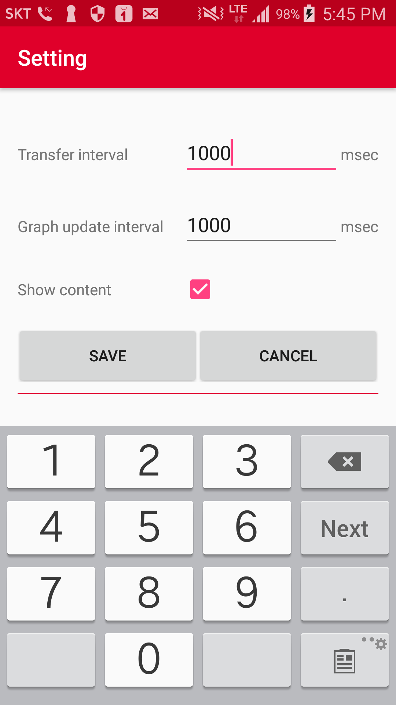

# thingplug-app-android
SKT ThingPlug Android Service Application
===
SKT ThingPlug 1.5 Android SDK를 활용하여 개발한 Sample Service App에 대한 설명입니다.

## Overview

Sensor 목록
---
1. Temperature(℃)
2. Humidity(％)
3. Light(㏓)
4. Free Memory (MB)

Actuator 목록
---
1. Buzzer : ringtone, notification, alarm
2. LED : off, red, green, blue, magenta, cyan, yellow, white

## Service Application
---
1. 동작 환경
	- Android OS 4.0.3(ICE_CREAM_SANDWICH_MR1, API Level 15) 이상
2. Device 선택
	 
	- ThingPlug 포털에 등록된 Device 목록을 표시합니다. 한번에 한개의 Device를 모니터링 할 수 있으므로 모니터링하고자 하는 Device를 선택합니다.
3. 원격 센서 목록
	 
	- 특정 센서 선택 시 해당 센서 상세 화면으로 이동합니다.
4. 센서 상세 화면
	 
    - 센서 상태값을 그래프로 표시합니다. 센서값에 따라 세로축이 변하도록 설정되어 있습니다.
5. 환경 설정
	 
    - Transfer interval(msec) : Device의 센서 주기보고 간격을 제어를 통해 전달
    - Graph update interval(msec) : 센서 상세 화면의 그래프를 갱신하는 간격
    - Show content : 선택시 Device로부터 전달된 content raw data

Copyright (c) 2017 SK Telecom Co., Ltd. All Rights Reserved.
